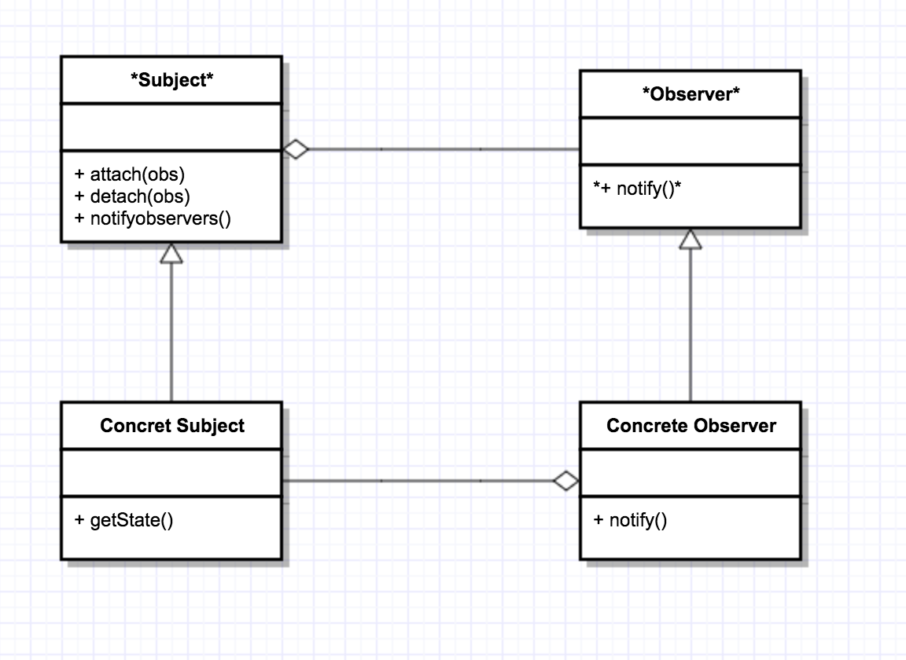
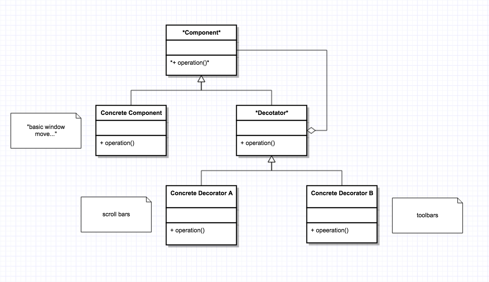
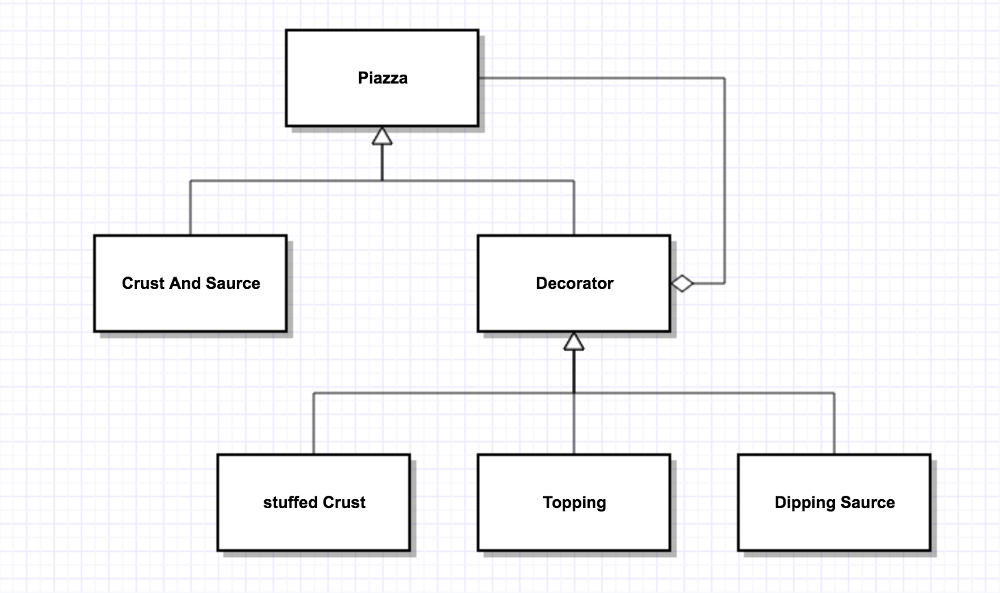
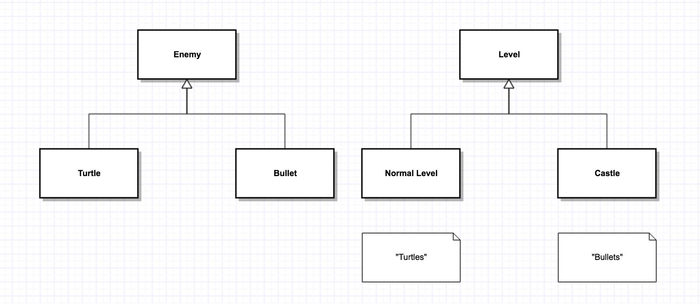

## Recall: Observer Pattern

- one publisher/Subject
- one or more Subscribers/Observers



```c++
//e.g.
class Subject{
  Vector<observer *>observers;
public:
  Subject();
  void attach(Observer *ob){}
  void detach(observer *ob){}
  void notifyobservers(){
    for(auto &do : observers) ob->notify();
  }
  virtual ~Subject()=0;	//pure virtual
};
Subject::~Subject(){}
```

```c++
class Observer{
public:
  virtual void notify()=0;
  virtual ~observer();
};
```

```c++
class HorseRace:public Subject{
  ifstream in;	//source of data
  string lastwinner;
public:
  HorseRace(string source):in{source}{}
  ~HorseRace(){}
  bool runRace(){return in >> lastwinner;}	//false at EOF
  string getState() const {return lastwinner;}
};
```

```c++
class Better: public Observer{
  HorseRace *subject;
  string name, myHorse;
public:
  Bettor(HOrseRace *hr, string name, string myHorse):subject{hr}, name{name}, myHorse{myHorse}
  {
    subject->attach(this);
  }
  void notify(){
    string winner = subject->getState();
    cout << (winner == myHorse ? "I won!" : "I lost") << endl;
  }
};
```


- Usage

```c++
int main(){
  HorseRace hr{"source.txt"};
  Bettor Larry(&hr, "Larry", "Runs Like A Cow");
  //... add more bettors
  while(hr.runRace()){
    hr.notifyObservers();
  }
}
```

- Simplifications:
  1. if the state is trivial (e.g. string). or if being notified is sufficient, you can eliminate `getState()`
  2. if you <u>know</u> you only have a single subject, you can merge Subject + Concrete Subject (e.g. HorseRace).
     - risk — hard to generalize later
  3. if subject and observer are the same thing, you can merge them (e.g. cell in spreadsheet)

## Decorator Pattern

- suppose to want to enhance("decorate") an object

  - i.e. add functionality at runtime

- e.g. basic window — add scrollbars

  ​				 — toolbars

  ​			         — status bar

- UML

   


- The class Component define's the interface

  - Concrete Component — implements it

- A decorator enhances a Concrete Component

  - decorator is a component and has a component
  - e.g. a window with a scrollbar is a window, that has a pointer to an underlying basic window
  - all window derive from component (i.e. abstract window class) so we can call methods on them polymorphically

- e.g. building a pizza

- UML

  

- Code:

  ```c++
  class Pizza{
  public:
    virtual float price() const = 0;
    virtual string desc() const = 0;
    virtual ~piazza();
  };
  ```

  ```c++
  class CrustAndSource: public Pizza{
  public:
    float price()const override {return 5.99;}
    string desc() const override {return "Pizza"}
  }
  ```

  ```c++
  class Decorator:public Pizza{
  protected:
    Pizza *component;	//has -a relationship
  public:
    Decorator(Pizza *p):component{p}{}
    virtual ~Decorator(){delete component;}	//owns -a relationship
  };
  ```

  ```c++
  class stuffedCrust:public Decorator{
  public:
    stuffedCrust(Pizza *p): Decorator{p}{}
    float price()const override{return component->price() + 2.69;}
    string desc() const override{return component->desc() + "with stuffed crust";}
  };
  ```

  ```c++
  class Topping: public Decorator{
    string theTopping;
  public:
    Topping(string topping, Pizza *p): Decorator{p}, theTopping{topping}{}
    float price() const override{return component->price()+ 0.75;}
    string desc() const override{return component->desc() + " with" + theTopping;}
  }
  ```

- Usage:

  ```c++
  int main(){
    Pizza *p1 = new CrustAndSaurce;
    p1 = new Topping("cheese", p1);
    p1 = new Topping("mushrooms", p1);
    p1 = new StuffedCrust(p1);
    cout << p1->desc()<< " " << p1->price() << endl;
    delete p1;
  }
  ```

## Factory Method Pattern

- aka Factory

- problem : writing a video game, with 2 kinds of enemies: turtles, bullets

  - the system needs to randomly generate enemies — but we want more bullets later in the game

- UML: 

- Since we never know exactly what we need to create, an't call constructors directly

  - we don't hard-code any policies — later on, we might want to expand to include (e.g.) difficulty level
  - should be customizable

- so - we create a Factory method to generate enemies for us

  ```c++
  class Level{
  public:
    virtual Enemy *createEnemy()=0;	//factory method
    //...
  };
  ```

  ```c++
  class NormalLevel:public Level{
  public:
    Enemy *createEnemy() override{
      // creates mostly turtles
    }
  };
  ```

  ```c++
  class Castle:public Level{
  public:
    Enemy *createEnemy() override{
      // creates mostly bullets
    }
  };
  ```

  - Usage

  ```c++
  int main(){
    Level *l = new NormalLevel;
    Enemy *e = l->createEnemy();
  }
  ```

## Template Method Pattern

- we want the subclass to override some, but not all behaviours of superclass

- e.g. red and green turtles

  ```c++
  class Turtle{
  public:
    void draw(){
      drawHead();
      drawShell();
      drawFeet();
    }
  private:
    void drawHead(){}
    void drawFeet{}
    virtual void drawShell()=0;
  };
  ```

  ```c++
  class RedTurtle:public Turtle{
    void drawShell() override{
      // red
    }
  };
  ```

  ```c++
  class greenTurtle:public Turtle{
    void drawShell() override{
      // green
    }
  };
  ```

## Extension: Non-Virtual Interface (NVI) idiom

- a public virtual methods for a class:
  1. an interface to the client — i.e. methods that someone can call
  2. an interface to your subclasses 
     - i.e. spec for derived classes
     - "hook" where subclasses can insert specialized begaviour
- NVI — tries to solve this
  1. all public methods should be non—virtual
  2. all virtual methods should be private(protected) — interface for derived
  3. except — dtor, always public

