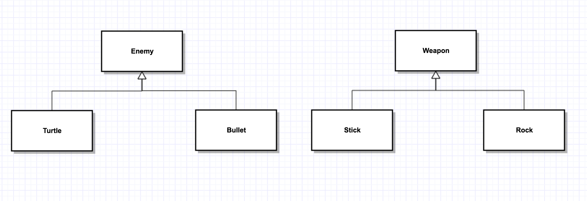
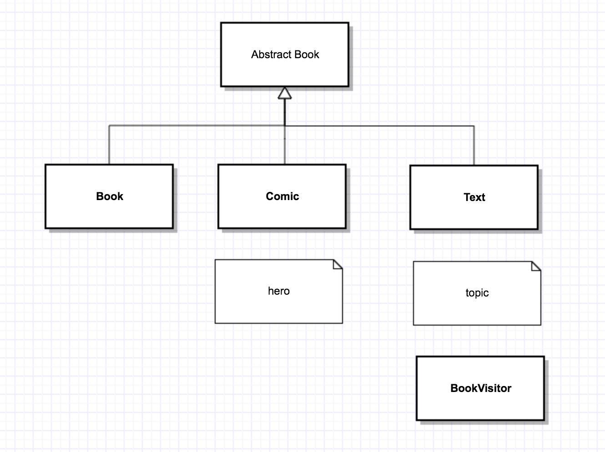
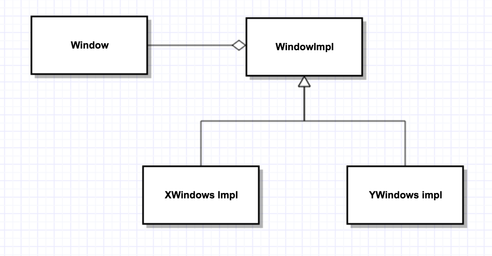

## Recall:Visitor

- virtual methods based on subtypes of 2 objects — double dispatch

  - i.e. a specific enemy with a specific weapon

- UML:

  

- code:

  ```c++
  //double dispatch - combine overloading with overriding
  class Enemy{
  public:
    virtual void beStruckBy(Weapon &w)=0;
    //...
  };
  class Turtle:public Enemy{
   public:
    void bestruckBy(Weapon &w)override{w.strike(*this);}
  };
  class Bullet:public Enemy{
  public:
    void beStruckBy(Weapon &w)override{w.strike(*this);}
  };
  ```


```c++
  class Weapon{
  public:
    virtual void strike(Turtle &t)=0;
    virtual void strike(Bullet &b)=0;
  };

  class Stick:public Weapon{
  public:
    void strike(Turtle &t) override{}	//stick + turtle
    void strike(Bullet &b) override{}	//stick + bullet
  }

  class Rock:public Weapon{
  public:
    void strike(Turtle &t) override{}	//stick + turtle
    void strike(Bullet &b) override{}	//stick + bullet
  }
```

- Usage

  ```c++
  int main(){
    Enemy *e = new Bullet();
    Enemy *w = new Rock();
    e->beStruckBy(*w);
  }
  ```

- What happens?

  - `Bullet::beStruckBy` runs(virtual)
    - it calls `Weapon::strike`, where `*this` is a Bullet
    - therefore Bullet version of the overload is called
    - virtual method strike(Bullet &b) resolves to `Rock::strike(Bullet &b)`

- Vistor can also be used to add functionality to existing classes, without recompiling them

  - e.g. add a visitor to the book hierarchy

  - UML

    

  - Code

    ```c++
    class AbstractBook{
    public:
      virtual void accept(BookVisitor &v)=0;
    };

    class Book:public AbstractBook{
    public:
      void accept(BookVisitor &v)override{v.visit(*this);}
    };

    class Text:public AbstractBook{
    public:
      void accept(BookVisitor &v)override{v.visit(*this);}
    };

    class Comic:public AbstractBook{
    public:
      void accept(BookVisitor &v)override{v.visit(*this);}
    };
    ```

    ```c++
    class BookVisitor{
    public:
      virtual void visit(Book &b)=0;
      virtual void visit(Text &t)=0;
      virtual void visit(Comic &c)=0;
    };
    ```

- what to do with it?

  - e.g. track number of books that I have
    - Book — count by author
    - Text — count by topic
    - Comic — count by hero

- we could use a <u>`map<string, int>`</u> for this

- this would mean adding a method virtual void updatemap(`map<string, int> &m`);

  - add as a static method to each derived book type

- use visitor instead:

  - catalog as a BookVisitor

  ```c++
  class Catalog:public BookVisitor{
    map<string, int> theCatalog;
  public:
    map<string, int>getCatalog(){return theCatalog;}
    void vist(Book &b){++theCatalog[b.getAuthor()];}
    void visit(Texy &t){++theCatalog[t.getTopic()];}
    void visit(Comic &c){++theCatalog[c.getHero()];}
  };

  AbstructBook *p = new Book();
  Catalog *c = new Catalog();
  p->accept(*c);
  ```

- Look at the headers:

  - book.h
    - includes BookVisitor.h
      - includes text.h
        - include book.h
  - Circular dependency — header guards prevent a header from being included multiple times
  - i.e. text.h never includes book.h
    - so the compiler, when compiling Text.h doesn't recognize Book

- Because of the include guard, Text.h doesn't get a copy of book.h, so compiler doesn't know what a Book is when we compile Text

- so — do we need all of these includes?


## Compiler Dependencies

- when does a compiler dependency exist( i.e. when do you need to #include a header )?

- consider 

  ```c++
  class A{
    
  };

  class B : class A{
    // need include A
  };

  class C{
    A myA;
    // need include A
  };

  class D{
    A *myAp;
    // doesn't need full information to A
  }

  class E{
    A f(A x);
    // doesn't need full information to A
  }
  ```

  - class B, C: yes, dependency — compiler needs to know the size of A
  - class D,E: no, not a true dependency — compiler just needs to know that A exists
    - a forward declaration is enough
    - i.e. "`#include "a.h" —> class A;`" forward declaration
  - So, compiler dependency — implies that you need to `#include header;` if not, a forward declaration is enough

- if a dependency doesn't exist, don't add an `#include` because that adds a dependency

- if class A changes, only class A, B, C need to be recompiled (in theory, if using forward declaration)

------

- Now, you have a stronger dependency in the implementation files for D, E

  - e.g.

    ```c++
    //d.cc
    #include "a.h"
    void D::f(A x){
      X.somemethod();
    }
    ```

  - Rules:

    - do the `#include` in the cc file when possible
    - `.cc` files don't include other .cc files, can't intruduce a circular dependency

- FIx: go through headers, replace includes with forward declarations

  - e.g. `text.h` can just forward declare `class Book`

------

## Consider: XWindows

```c++
class XWindow{
  Display *d;
  Window w;
  int s;		// private fields - you shouldn't need to see these
  GC gc;		// you definitely shouldn't modify
  unsigned long colors[10];
public:
  //...
};
```

- This limits our ability to change code later

  - any changes to private data forces all users/clients to recompile
  - we'd prefer to hide the details away

- Solution: use the plmpl idiom (pointer - to - implementation)

  - createa second class to hold our impl. details:

    ```c++
    //XWindowImpl.h
    #include <X11/Xlib.h>	//main XWindows header
    struct XWindowImpl{
      Display *d;
      Window w;
      int s;
      GC gc;
      unsigned long colors[10];
    };
    ```

    ```c++
    // window.h
    // no need to include XWindows/Xlib.h
    class XWindowImpl;	//forward declare
    class XWindow{
      XwindowImpl *plmpl;	//no compilation dependency
    public:
      //...
    };
    ```

    ```c++
    // window.cc
    #include "window.h"
    #include "XwindowImpl.h"

    Xwindow::Xwindow(...)::plmpl{new XWindowImpl}{}
    // * in other methods:
    // d -> plmpl -> d
    // w -> plmpl -> w
    ```

- if you confine all private fields to XWindowImpl, then only `window.cc` needs to be recompiled if you change the implementation

### Generalization

- what if we have several possible window implementations?
  - make Impl a superclass

  - UML

    
- The pimple idiom with a class hierarchy of implementations is called the Bridge Pattern


## Measures of Design Quality

- coupling v.s. cohesion
- Coupling — degree to which modules depend on one another
  - (low) modules that communicate with function calls, pass/return basic types(e.g. ints)
  - (med) modules that pass structs or arrays
  - (med) modules that affect each others control flow
  - (med) modules that share global data
  - (high) modules that know about impl (friends)

