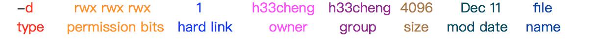

## I/O stream

- `<` input redirect
- `>` output redirect
- `>>` stderr(stander error) redirect

# Pips |

- use output from one command as input for second command
  - e.g. `head -10 file.txt | wc -w`
  - e.g. `cat words | sort | uniq`
- we can also use output from oone command as a parameter for another
  - `echo "abc"`
  - `echo "today is $(date)"`

## Pattern Matching(in text)

- Globbing patterns
  - `*`represent any number of chars in file
    - e..g `ls *.txt` (prints a list of all files end in .txt)
  - `?` represent single character
- Regular expressions(Regex)
  - way of pattern matching strings
    - e.g. website, JS libraries — valuable input
    - e.g. text editors
  - `egrep` — command line utility uses regex for files

## egrep

- egrep pattern(regular expresion) file

  - e.g. `egrep "cs246" index.shtml`
  - () sub-exxpression, gets evaluated
    - e.g. `(cs|CS)246` — cs246/CS246
    - e.g. `(c|C)(s|S)246` — cs246, CS246, cS246, Cs246
  - [] match a single character in brackets
    - e.g. `text[abc]` — texta, textb, textc
    - e.g. `[cC][sS]246` — cs246, CS246, cS246, Cs246
    - e.g. `text[a-c]` — text, textb, textc
  - [^…] match any one character except these
    - e.g.`[^A]bc` — string without A at start
  - . represents any single character — user for positional input
  - ^ is begin of line, $ is end of line in a regular expression
    - e.g. `^cs245` — matches string only t the begining of the line

  ### Frequency

  - ? after the pattern represent 0 or 1 instances that pattern
    - e.g. `^cs ?246` — cs246 or cs 246(i.e. space)
  - \* after a pattern represents 0 or more instances of that pattern
    - e.g. `(cs)*246` — 246, cs246, cscs246….
  - \+ after a pattern represents 1 or more
    - e.g. `(cs)+246` — cs246, cscs246….
  - e.g. `^.*log$` — any string ending in log
  - e.g. fetch lines of even length
    - `egrep "^(..)+$"`
  - e.g. list files in the current directory whose name contains only 1 "a"
    - `ls -c | egrep "^[^a]*(a)[^a]*$"`
      - 第一部分`[^a]*` — 0~n个不含a的字母
      - 第二部分`(a)` — 包含一个a
      - 第三部分`[^a]` — 0~n个不含a的字母
      - `*` 为关键

## File systems

- in Unix, files and directories are structured in a tree

- top node of tree is called the root(`/`)

- all files and directories are nodes in the tree

- absolute path is location of file / directory relative to the root

  - e.g. `/u4/j2avery absolute path ot my home directory`

- working `/` current directory

  - directory where shell will look for files and/or operate
  - `ls -l`
    - 

- owner

  - primary user for a file(creator) -h33cheng(userid)
  - also called "user"
  - specific permissions

- group

  - set of users with specific permissions (staff, students, admins….)

- `rwx rwx rwx`

  - first rwx represent the user/owner
  - second rwx represent the group
  - last rwx represent other

- | bit  | file                          | directories                              |
  | ---- | ----------------------------- | ---------------------------------------- |
  | -r   | file contents can be read     | directories contents can be read                      (e.g. `ls`) |
  | -w   | file contents can be modified | directories cantents can be modified               (e.g. create/remove file) |
  | -x   | file contents can be executed | directories comtents can be navigated            (e.g. disabling x on directories makes it unusable!) |

  ​

- chmod — change permissions on file/dir

  - `chmod[u,g,o][+,-,=][r,w,x]`
    - e.g. `chmod g+w file` — add w to a group(non-destructive)
    - e.g. `chmod u+rw file` — add r and w to user
    - e.g. `chmod u = rw file` — destructive, replaces permissions for that role

