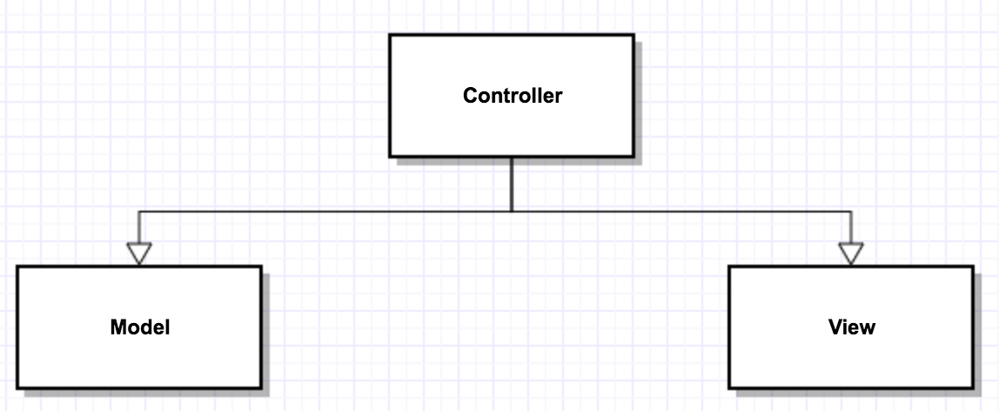

## Recall: measures of Design Quality

- compiling & Cohesion

  - Compiling — degree to whitch distinct modules depend on each other
    - (low) modules communicate with functions/ basic parameters
    - (med) modules pass arrays/ structs
    - (med) modules share global data
    - (high) modules access each other's impl'n(firends)
  - high coupling is bad
    - changes to one module requires changes to others
    - difficult to reuse
    - goal — low coupling (when possible

  ------

  - Cohesion — how closely related elements of a module are to each other
    - (low) arbitrary grouping of unrelated elements(e.g. `<utility>`)
    - (med) elements that share a common theme, oerhaps share code (e.g. `<algorithms>`)
    - (med) elements that manipulate the state of an object over its lifetime(e.g. open/ read/ close a file)
    - (med) elements that pass data between them
    - (high) elements taht cooperate on a single task(e.g. decorators)
  - low cohesion is bad
    - generally leads to poorly organized code
    - hard to understand or maintain

- Goal — low coupling — promote reusability / extensibility

  ​	 — high cohesion — easy to understand / maintain

## Decoupling the Interface (MVC)

- e.g. a chess game

  ```c++
  class ChessBoard{
    //...
    cout << "your move" << endl;
    //...
  };
  ```


- - This is bad design — your chess game shouldn't be printing — want our app to be customizable / flexible
  - assume that we want `stdin/stdout`
    - hard to change later

- what if we want to reuse, without using `stdin/stdout`?

  - Butter solution: pass in stream objects (i.e. tell it what to use)

  ```c++
  class ChaessBoard{
    istream &in;
    ostream &out;
  public:
    ChessBoard(istream &in, ostream &out):in{in}, out{out}{}
    //...
    out << "Your move" << endl;
  };
  ```

- what if we don't want streams at all?

  - output (not well -suited to ostreamsf (except text))
    - graphical display
    - screen reader
    - text
  - input (not well - suited for istream)
    - mouse
    - joystick
    - voice — dictation
    - keyboard

------

- Chessboard should not be doing any of this. (not directly)


- **Single Responsibility Principle** — "a class should only have one reason to change state" i.e. a class should do one thing (well)
- game state / chess + communication — 2 things
- Better solution: define some external  entity / class that handles commmunication
  - clesboard communicates via basic function calls / parameters / exceptions
  - user interaction managed by other class
- Question — can `main()` do this? NO ! we want it to be reusable etc


## Pattern: Model-View-Controller (mvc)

- separate application into: data(state), presentation of data, and control of data

  1. model — data; or state you are manipulating (e.g. chess game)
  2. view — presentation, how the user sees the data (e.g. chess board)
     - graphical
     - text
     - screen - reader
  3. controller — how the model is manipulated (e.g. chess input)
     - keyboard
     - mouse
     - voice input

   

  ​

- The model

  - manages state
  - can be loosely coupled to one or more views
  - doesn't need to know details — typically notifies about state change
    - Observer Pattern
      - model — Subject
      - view — observers

- The view

  - presents data
  - subscribes to model changes

- The Controller

  - mediates Communication between the Model and View
  - may communicate with user for input
  - may encapsulate turn — taking, or game
    - rules (with model) 


- Why is this useful? allows extensibility & customization


## Exception Safety

- Consider:

  e.g. :

  ```c++
  void f(){						// this is ok
    MyClass *p = new MyClass;
    MyClass mc;
    g();
    //...
    delete p;
  }
  ```

  - This is ok …. as long as it executes normally 
  - What if g() throws an exception?
  - Whay's guaranteed?

- during call-stack unwinding (while handling exceptions), all stack — allocated data is cleaned up — destructors are called, memory is freed

- heap allocated memory is not freed

  - mc is deleted properly (Stack)
  - p leaks memory (heap)

- This seens easy to fix:

  ```c++
  void f(){
    myClass *p = new myclass;
    myclass mc;
    try{
      g();
    }
    catch(....){
      delete p;
      throw;
    }
    delete p;
  }
  // tedius, error- prone, redundant
  ```

- In some other languages, you can specify a block of code that will always run call "finally"

  ```java
  //e.g.
  try{
    g();
  }
  catch(...){
    cout << "Bad stuff" << endl;
    throw;
  }finally{
    delete p;
  }
  // Java
  // Not C++
  ```

- What does C++ guarantee?

  - it guarantees that destructors for stack-allocated objects will run
  - so, use stack - allocated objects - all the time

## C++ Idiom: RAII — Resource Acquisition Is Initialization

- Every resource shoud be wrapped in a stack-allocated object, whose destructor frees it/ releases the resource.

  - e.g.

    ```c++
    {
      ifstream f{"text.txt"};
    }
    ```

- Acquiring the resource (the file) happens when you initialize it

  - The file is guaranteed to be closed when the stack unwinds and f goes out of scope (i.e. f's dtor runs)

- This can also be done with dynamic memory

  - Clsss `std::unique_ptr<T>`, a template class that holds a pointer to an object of type T
    - supply a pointer in the constructor (`#incude <memory>`)

- e.g.

  ```c++
  void f(){
    auto p = std::make_unique<myClass>();	
    // allocates space for a myClass object and returns a 	 
    //   unique_ptr<myClass>
    myClass mc;
    g();
    // p and mc are both stack allocated - no leaks
  }
  ```

### Difficulty

```c++
class c{}
auto p = std::make_unique<c>();
unique_ptr<c> q = p;	//error

// p and q are pointing to the same memory
// when one goes out of scope - calls delete
// other pointer is now invalid
// you're not allowed to copy unique_ptr
// But you can move them
// e.g. return a unique_ptr as a rvalue from a method and move
//   construct/assign.
```

- So, copying isn't allowed / moving is allowed

  - in git...

  ```c++
  template<typename T> class unique_ptr{
    T *ptr;
  public:
    unique_ptr(T *p):ptr{p}{}
    ~unique_ptr(){delete ptr;}
    
    unique_ptr(const unique_ptr<T> &other) = delete;
    unique_ptr &operator=(const unique.ptr<T> &other) = delete;
    unique_ptr(unique_ptr<T> &&other): ptr{other.ptr}{
      other.ptr = nullptr;
    }
  };
  ```

  - `= 0` pure virtual
  - `= delete` do not generate this
  - `= default` generate the default