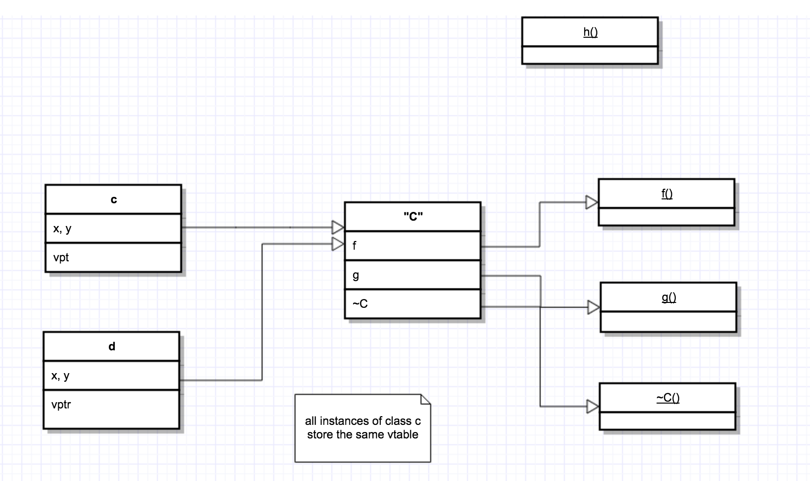
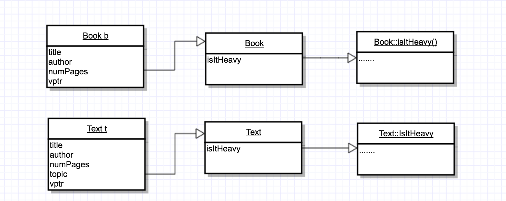
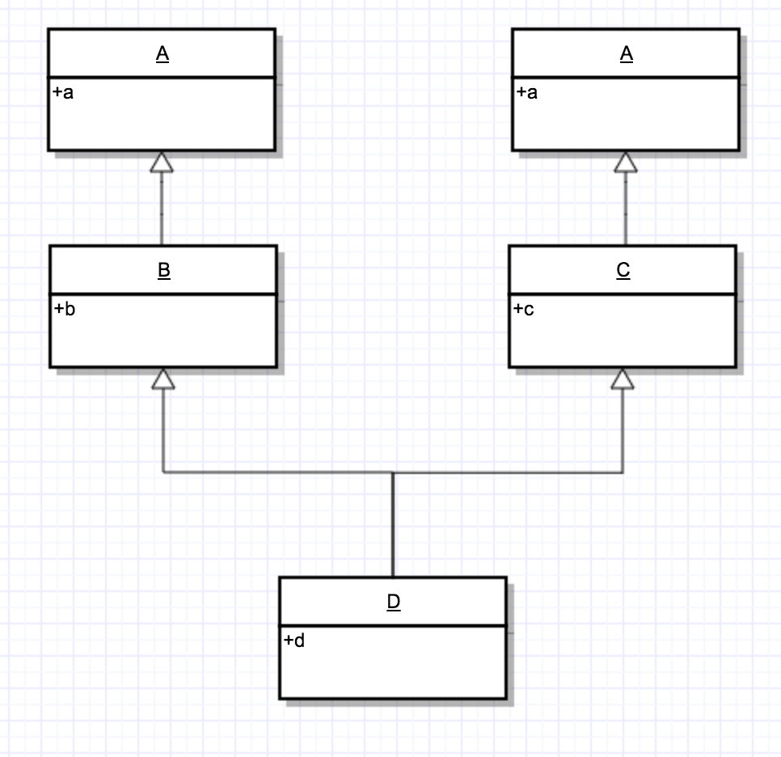
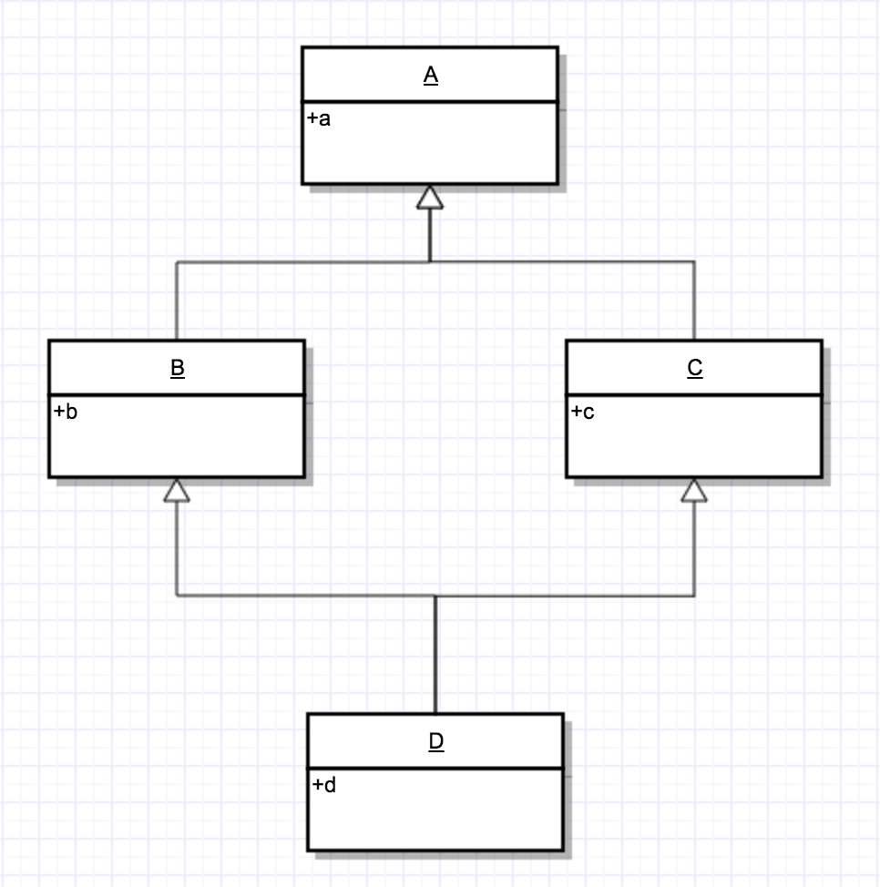
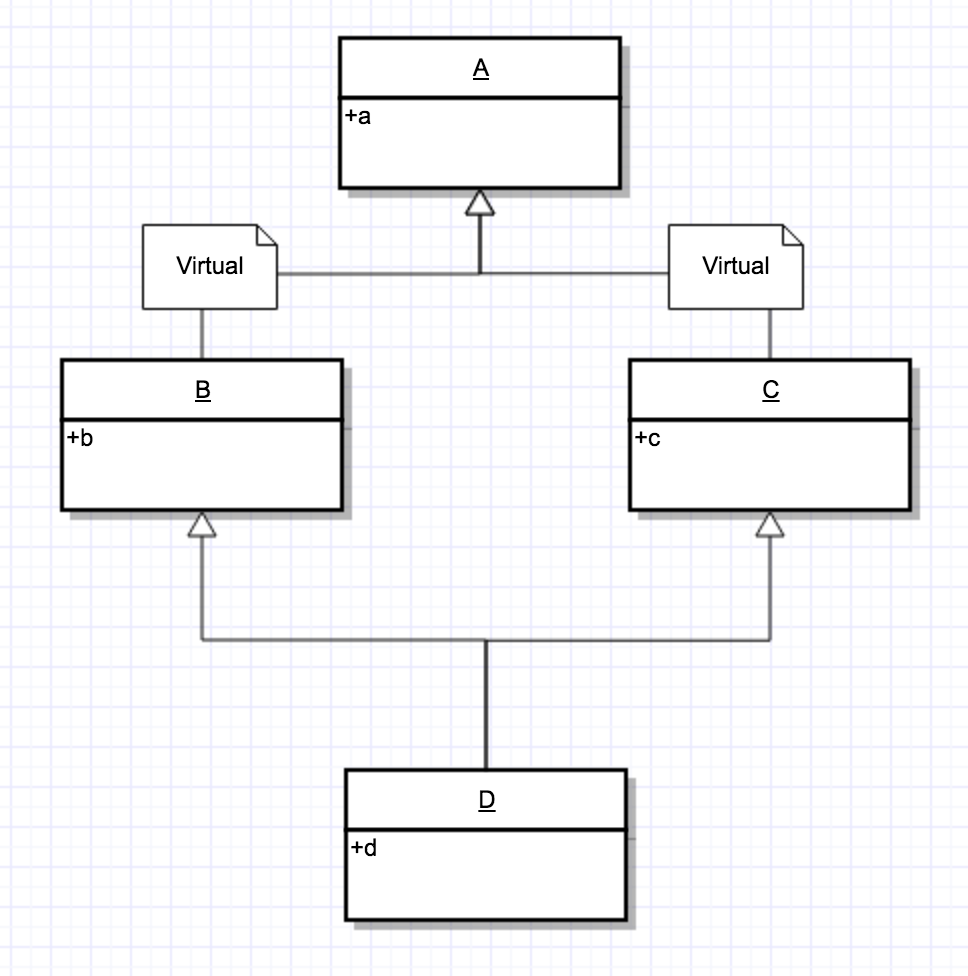

## Recall:Casting

1. static — cast						shared_ptr — cast
2. reinterpret — cast                       
3. const — cast                                          const_ptr — cast
4. dynamic — cast                                     dynamic_ptr — cast

- e.g.

  ```c++
  void whatIsIt(shared_ptr<Book> b){
    if(dynamic_ptr_cast<Comic> b) cout << "comic";
    else if(dynamic_ptr_cast<Text> b) const << "Text";
    else cout << "Book";
  }
  ```

- Dynamic casting also works with references

  ```c++
  Text t{...};
  Book &b = t;	//Text if a Book - text has a topic
  //...
  //...
  Text &t2 = dynamic_cast<Text &>b;
  // if b "points to" a Text - thus works fine
  // if b does not point to a Text - throws a BAD-CAST excepton
  //								 - we cannot fail to initialize a reference
  //								 - and cannot set to nullptr
  ```

- With dynamic reference casting, we can do polymor phic assignment poblem

  ```c++
  Text &Text::operator=(const Book &other){
    Text &othertext = dynamic_cast<Text &>other;
    // if fails, throws BAD-CAST exception
    if(this == &textother) return *this;
    Book::operator=(other);
    topic = othertext.topic;
    return *this;
  }
  ```


## How virtual methods work

- e.g. consider 2 classes:

  ```c++
  class Vec{
    int x,y;
  public:
    int doSomething();
  };

  class Vec2:public Vec{
    int x,y;
  public:
    virtual int doSomething();
  }
  ```

  - what's the difference?

  ```c++
  Vec v{1,2};
  Vec 2 w{1,2};	//do these look the same in memory?

  cout << sizeof(v) << " " << sizeof(w) << endl;	//hint int = 4
  //       8 byts	      16 byts(2 ints + pointer)
  ```

  - So, there is no space in an object for `doSomething()` method
    - compiler stores ordinary functions separately

- Recall — virtual methods

  ```c++
  Book *bp = new Comic(); // or Text
  auto bp = make_shared<Comic>();
  bp->isItHeavy(); //virtual method,
  ```

- if isIsHeavy is virtual, the compiler determines the type at runtime, and uses that info to determine which version of the method to run

- How?

  - For each class with virtual methods, the compiler creates a table of function pointers — called a vtable
  - instances of that class have a pointer to that table

  ```c++
  class C{
    int x,y;
    virtual void f();
    virtual void g();
    void h();
    virtual ~C();
  };
  ```

  

- e.g. Book,Text

  

- Steps in calling a cirtual method:

  1. from the object, follow the vptr to the vtable
  2. fetch the pointer to the actual method from the vtable
  3. follow the function pointer, and call the function

- This happens at run time

  - compiler cannot optimize — away
  - you incur a (small) overhead cost when sing virtual functions
  - also, adding a virtual function adds a ptr to every object of that type
    - i.e. classes with no virtual functions — produce smaller objects


## Concretely — how is an object laid out ?

- This  is compiler — dependent — we'll talk g++

- in general (g++)

  |  vptr   |
  | :-----: |
  | field1  |
  | field2  |
  |   ….    |
  | field n |

  - g++ attempts to put vptr at the top

    - we can always find the vtable
    - compiler doesn't need to lookup/know the type — performance advantage

  - e.g.

    ```c++
    class a{
      itn a,c;
      virtual void f();
    };
    ```

    | vptr |
    | :--: |
    |  a   |
    |  c   |

  - e.g.

    ```c++
    class b: public a{
      int b,d;
    };
    ```

    |    vptr    |
    | :--------: |
    | a(a field) |
    | c(a field) |
    | b(b field) |
    | d(b field) |

    ​

## Multiple Inheritance

- A class can inhert from more than one class

  ```c++
  class a{
    int a;
  };
  ```

  ```c++
  class b{
    int b;
  };
  ```

  ```c++
  class c:public a, public b{
    void f(){
      cout << a << b;
    }
  };
  ```

- Challenge:

  - suppose b inherits from a, c inherits from a

    

    ```c++
    class D:public b, public c{
    public:
      int d;
    };

    D dobj;
    dobj.a = 5; // which a?
    ```

- The access to field a is ambiguous

  - i.e. we mean the a that comes from B, or the a from C?
  - since its ambiguous — compiler rejects/won;t compile

- we need to specify which one: (scope resolution)

  - `dobj::b::a`
  - `dobj::c::a`

- If b and c hoth inheril from A — do we really want one a or a 2A?

  - should `b::a` and `c::a` be different? (no)
  - but by default, with inheritance, you will get 2 copies of a

- What if you really want 1 copy of A ?

  

- "deadly diamond"(of death, doom and despair)

  - ambiguity is bad

- To avoid ambiguty

  - make A a virtual bbase class, and use virtual inheritance

  - i.e.

    ```c++
    class B:virtual public A{...};
    class C:virtual public A{...};
    class D:public B, public C{...};
    ```

  - e.g. stream hierarchy

### How is this laid out?



| instance | fields  |
| :------: | :-----: |
|    A     |    A    |
|    B     |   B,A   |
|    C     |   C,A   |
|    D     | D,B,C,A |

- we need to setup in memory to access appropriate fields  for a type

- e.g. create an object d I also need to be able to use different pointers

  - object D is a:
    - A* (work)
    - B* (work)
    - C* (BAD)
    - D* (work)

- So, the simple layout doesn't work for all types of pointers

  - what does g++ do?

    | vptr |
    | :--: |
    |  B   |
    | vptr |
    |  C   |
    |  D   |
    | vptr |
    |  A   |

  - these sometimes need to be able to find each other

  - issue - B doesn't know about C, D

    - even I can give B a pointer to B fields, it can't find A fields
    - we cant just give it on effect to A fields

