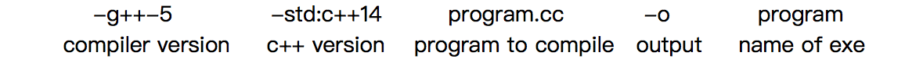

## Example

```shell
#!/ban/bash
answer(){
  if [ $1 -eq 31 ]; then
  	echo "This month: the 31st"
  else
  	echo "this month: the ${1}th"
  fi
}
```

## Testing

- essential part of the development
  - anytime through development — not just at end
  - begins before you start coding — expected behaviour
  - test suits — set of tests representing this behaviour
- not debugging
  - debugging is frequently ad hc
  - systematic, not ad hc, repeatable
- can't guarantee correctness — can only prove wrongs
- as a developer you should test
- but you should also have a test
  - i.e. 2 different people
  - avoid biases

### 2 types of testing

- human testing
  - humans looking over code, find flaws
  - code inspections, walkthroughs
- machine testing
  - automated test
  - run program on selected input, check against spec
  - black/ gray/ white -box testing
  - black box — no knowledge
  - white box — full knowledge
  - gray box — some knowledge
- approach
  - start with black box, supplement with white box
    - check interface, use
    - various class of input
    - data
    - multi simulators
    - extreme case
  - white box
    - ensure exaction of all logical parts
    - make sure every function runs
  - these are all logical/functional test
  - also have preference test — is the program efficient(enough)?
  - regression test
    - test suits consist of all box tests
    - as you add new functionally, add new tests
    - new changes to a program don't break old test cases
      - always add
      - never remove

## C++

- Note

  - main must return an int in c++
  - c++ I/O: uses header `<iostream>`
    - can use `stdio.h` printf — but you shouldn't 
    - output:
      - `std::cout<<....<<...<<....<<std::endl;`
      - `std` is a namespace, collection of features
      - using namespace std, std, lets you use cout, endl
        - without std:: in front
    - return statement — returns a status code ($? -bash)
      - if left ant, main return 0

- Compiling

  - 

- Input/Output

  - 3 I/O staments

    - `cout` — print to stdout
    - `cin` — reads from stdin
    - `cerr` — prints to stder

  - I/O operators:

    - `<<` "put to" e.g. `cerr << x;`
    - `>>` "get from" e.g. `cin>>y;`

  - e.g.

    - add 2 numbers

    ```c++
    #include <iostream>
    using namespace std;
    int main(){
      int x,y;
      cin >> x >> y;
      cout << x+7 <<endl;
    }
    ```

  - `cin >> ` ignores whitespace

  - `cin >> x >> y` gets 2 integers into x and y

  - if a read fails `cin.fail()` will be true

  - if we hit EOF, `cin.eof()` will be true -note if EOF, both flags will be triggered(i.e. fails first, then triggers EOF)

  - e.g.

    ```c++
    int main(){
      while(true)
      {
          cin >> i;
        if(cin.fail())
        {
          break;
        }
        cout << i << endl;
      }
    }
    ```

    ​

